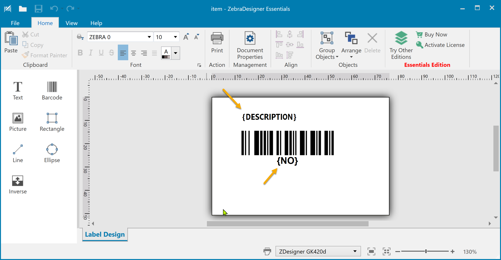
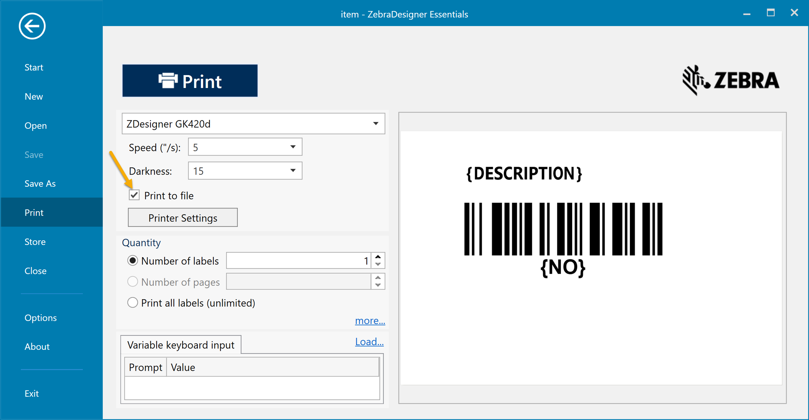

# ForNav.Demo.Zebra

This repository is a demo of how to use the native Zebra Printing Language (ZPL) with ForNAV Direct Print.

These are the steps included in the process:

* [Design the label](#design-the-label)
* [Save the layout](#save-the-layout)
* [Convert to BASE64](#convert-to-base64)
* [AL Code](#al-code)

## Design the label

You can use ZebraDesigner to create your label. Some elements of your design show dynamic data. Use placeholder text in the design and substitute the placeholders with the real values in the AL code.



In the shown example, there are two placeholders for an item description *{DESCRIPTION}* and the item number *{NO}*.

## Save the layout

When the layout is finished, you want to get the ZPL that describes it. If you print your label to a file, you can get that from the designer.



You should save the layout in a normal layout file to modify it later.

## Convert to BASE64

The ZPL file is used in your AL code, so you need to store it in Business Central. You could save it to a BLOB file or put it in the AL code as a BASE64 string.

In this example, the ZPL data is placed in a BASE64 string for simplicity. You can use an online service to convert your ZPL file to BASE64.

## AL Code

The AL code is where the magic happens. You can use the example code below to get an idea of how to work with the ZPL code and send it to a printer.

The code converts the BASE64-encoded ZPL string to normal text and replaces the placeholders with actual data from the Item record.

A print job is created with the ZPL, and the print service will handle the rest. The content type of the print job is set to Zebra. This will make the print service send the job in RAW format to the printer.

```al
trigger OnAction()
var
    DirPrtQueue: Record "ForNAV DirPrt Queue";
    Base64Convert: Codeunit "Base64 Convert";
    tempBlob: Codeunit "Temp Blob";
    base64, zpl : Text;
    zplInStream: InStream;
    zplOutStream: OutStream;
begin
    // Get Zebra language from stored base64 string
    base64 := 'Q1R+fkNELH5DQ15+Q1R+Cl5YQX5UQTAwMH5KU05eTFQwXk1OV15NVEReUE9OXlBNTl5MSDAsMF5KTUFeUFI1LDV+U0QxNV5KVVNeTFJOXkNJMF5YWgpeWEEKXk1NVApeUFc2MDkKXkxMMDQwNgpeTFMwCl5CWTQsMyw4NF5GVDEwMiwxOTleQkNOLCxZLE4KXkZEPjp7Tk99XkZTCl5GVDEwMiw4MF5BME4sMjgsMjheRkhcXkZEe0RFU0NSSVBUSU9OfV5GUwpeUFExLDAsMSxZXlha';
    zpl := Base64Convert.FromBase64(base64);

    // Replace the placeholders with the real data
    zpl := zpl.Replace('{NO}', Rec."No.").Replace('{DESCRIPTION}', Rec.Description);

    // Create an InStream with the Zebra language
    tempBlob.CreateOutStream(zplOutStream);
    zplOutStream.WriteText(zpl);
    tempBlob.CreateInStream(zplInStream);

    // Create a print job on the print queue
    DirPrtQueue.Create('Item Label', 'Zebra Demo', zplInStream, DirPrtQueue.ContentType::Zebra);
end;
```

## Notes

Using native ZPL instead of a normal Windows print job has some benefits.

* Access to all the special commands supported by the Zebra printers. 
* Performance will most likely be better.
* Improved graphics and barcode quality.

## GitHub

This project is available on GitHub.

https://github.com/fornav/ForNav.Demo.Zebra